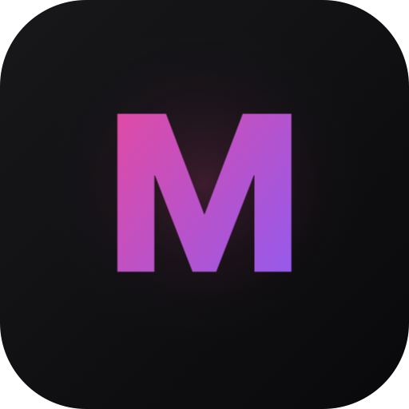
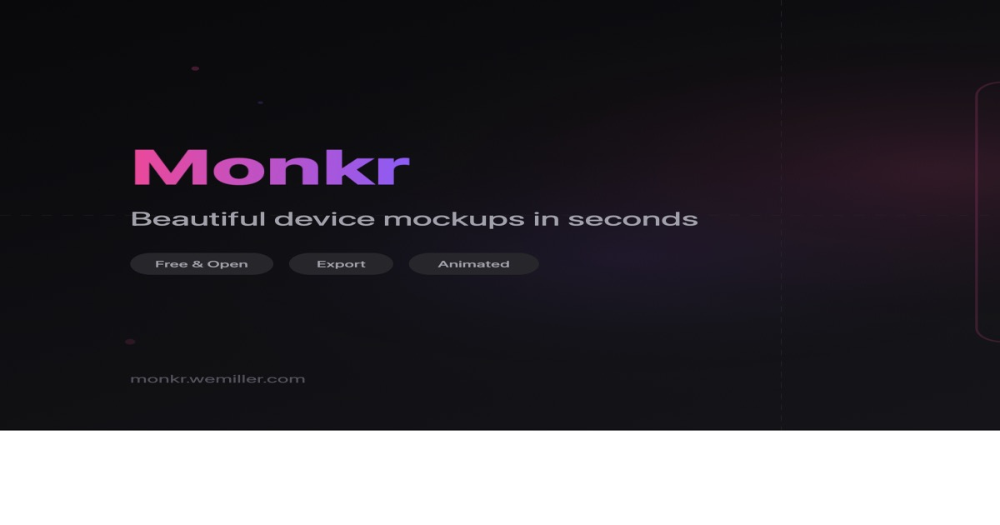

<p align="center">
  <a href="https://monkr.wemiller.com">
    
  </a>
</p>

<h1 align="center">Monkr</h1>

<p align="center">
  <strong>Beautiful device mockups in seconds.</strong><br/>
  Free, open-source, and runs entirely in your browser.
</p>

<p align="center">
  <a href="https://monkr.wemiller.com"><strong>Try it live</strong></a> &bull;
  <a href="#features">Features</a> &bull;
  <a href="#getting-started">Get Started</a> &bull;
  <a href="#tech-stack">Tech Stack</a> &bull;
  <a href="#license">License</a>
</p>

<p align="center">
  
  
  
  
</p>

<br/>

<p align="center">
  
</p>

---

## Why Monkr?

Most mockup tools are either bloated desktop apps, locked behind subscriptions, or require uploading your screenshots to someone else's server. **Monkr is different** - it's a fast, privacy-first mockup generator that runs 100% in your browser. No accounts, no uploads, no watermarks.

Drop in a screenshot, pick a device, choose a background, and download a polished mockup in seconds. Need App Store screenshots? Animated previews? Multi-device compositions? Monkr handles it all.

---

## Features

### 20+ Device Frames

Pixel-perfect frames for the devices people actually use:

| Category | Devices |
|----------|---------|
| **iPhone** | 17 Pro Max, 17 Pro, 17 Air, 17, 16 Pro Max, 16 Pro, 16 Plus, 16, 15 series, 14 series |
| **Android** | Pixel 7 Pro, Nothing Phone |
| **iPad** | Pro 13", Pro 11", Air, Mini |
| **Mac** | MacBook Pro 16", MacBook Air M2, MacBook Air 13" |
| **Desktop** | iMac 24", iMac Pro, Pro Display XDR |
| **Other** | Apple TV 4K, Flat Screen TV, Browser (Light & Dark) |

Each device includes multiple color variants and can be freely positioned, scaled, rotated, and tilted in 3D.

### Backgrounds That Pop

- **30+ gradient presets** - Cosmic, warm, cool, nature, pastel, neon, and mesh gradients
- **100+ curated images** - Abstract, cosmic, earth, holographic, mystic, glass, radiant, vintage, and classic macOS wallpapers (Big Sur through Tahoe)
- **Solid colors** with full color picker
- **Transparent** backgrounds for compositing
- **Custom uploads** - drag & drop any image
- **Unsplash integration** - search millions of free photos

### Scene Presets

One-click layouts that look professional instantly:

- **Single device** - Hero shots, centered, tilted
- **Duo layouts** - Side by side, overlapping, responsive pairs
- **Multi-device** - Fan spreads, perspective rows, cascades
- **Ecosystem** - Full Apple lineup in one shot
- **App Store** - Pre-configured multi-slide layouts for iPhone and iPad

### App Store Screenshot Mode

Built specifically for shipping apps:

- Toggle App Store mode and pick your platform (iPhone 6.7", 6.1", iPad 12.9", 11")
- Canvas automatically sizes to App Store guidelines
- Choose 1-10 sections that split the canvas into slides
- Design across all slides using the same tools
- Export slices each section into a separate screenshot
- Visual divider lines and section labels keep you oriented

### Text Overlays

- Multiple font families with weight control (100-900)
- Alignment, letter spacing, and line height
- Text shadow with color, blur, and offset
- **Arc text** for curved headlines
- Position above, below, or anywhere on canvas
- 3D tilt and rotation

### Animation & Video Export

Create animated mockups and export as video:

- **6 animation presets** - Full Spin, Rock, Tilt Showcase, Float, Zoom Pulse, Slide In
- Adjustable duration and FPS
- Loop support
- Export as **MP4** (H.264), **MOV**, or **WebM** (VP9)
- Powered by FFmpeg WASM - encoding happens entirely in your browser

### Export Options

| Format | Use Case |
|--------|----------|
| **PNG** | Lossless quality, transparency support |
| **JPG** | Smaller files, great for web |
| **MP4** | Animated mockups, social media |
| **MOV** | QuickTime-compatible video |
| **WebM** | Web-optimized video |

All image exports support **1x, 2x, and 3x** scale for retina-quality output. One-click **copy to clipboard** for quick sharing.

### Device Customization

Every device on the canvas can be individually tuned:

- **Position** - Drag or use precise X/Y controls
- **Scale** - Pinch or slider from tiny to oversized
- **Rotation** - Free rotation in degrees
- **3D Tilt** - Perspective tilt on X and Y axes
- **Shadow** - Color, blur, spread, and offset
- **Glow** - Edge glow with customizable color and intensity
- **Frame style** - Full device frame, outline only, or frameless

### Layout Templates

20+ arrangement templates for multi-device compositions:

- Single Center, Tilted, Hero Left/Right
- Side by Side, Overlap, Stacked
- Fan, Cascade, Perspective Row
- Grid 2x2, Scattered, Isometric
- Phone+Tablet, Laptop+Phone, Floating Stack
- Showcase 5 and more

### Canvas Presets

Pre-configured sizes for every platform:

- **General** - 16:9, 9:16, 1:1, Ultrawide
- **Social** - Dribbble, Twitter, Instagram (Post & Story), LinkedIn, Product Hunt, Open Graph
- **App Store** - All iPhone sizes, iPad, Mac, Apple TV, Apple Watch
- **Google Play** - Phone, Tablet 7" & 10", Feature Graphic

### Quality of Life

- **Auto-save** - Your project persists in localStorage automatically
- **Import/Export** - Save and load `.monkr` project files
- **Reset** - One-click clean slate
- **Mobile friendly** - Responsive sidebar with swipe navigation
- **Zero server dependency** - Everything runs client-side

---

## Getting Started

### Use it now

Head to **[monkr.wemiller.com](https://monkr.wemiller.com)** and start creating.

### Run locally

```bash
git clone https://github.com/blaineam/Monkr.git
cd Monkr
npm install
npm run dev
```

Open [http://localhost:5173](http://localhost:5173) and you're in.

### Build for production

```bash
npm run build
npm run preview  # preview the build locally
```

The static build outputs to `build/` and can be deployed anywhere - GitHub Pages, Netlify, Vercel, Cloudflare Pages, or your own server.

---

## Tech Stack

| Layer | Technology |
|-------|-----------|
| **Framework** | [SvelteKit](https://kit.svelte.dev) 2 + [Svelte](https://svelte.dev) 5 (runes) |
| **Language** | [TypeScript](https://typescriptlang.org) 5.9 |
| **Styling** | [Tailwind CSS](https://tailwindcss.com) 4 |
| **Icons** | [Lucide](https://lucide.dev) |
| **Image Export** | [html-to-image](https://github.com/bubkoo/html-to-image) |
| **Video Export** | [FFmpeg WASM](https://ffmpegwasm.netlify.app) |
| **Build** | [Vite](https://vitejs.dev) 7 |
| **Deploy** | Static adapter (GitHub Pages) |

---

## Project Structure

```
src/
├── lib/
│   ├── components/     # Svelte components (Canvas, Sidebar, ExportButton, etc.)
│   ├── stores/         # State management with Svelte 5 runes
│   ├── animation.ts    # Animation system + FFmpeg video export
│   ├── backgrounds.ts  # Curated background image registry
│   ├── export.ts       # Image export + App Store section slicing
│   ├── fonts.ts        # Font loading and management
│   ├── gradients.ts    # Gradient preset definitions
│   ├── mockups.ts      # Perspective mockup scenes
│   ├── presets.ts      # Canvas size presets
│   ├── scenes.ts       # One-click scene presets
│   ├── templates.ts    # Layout arrangement templates
│   ├── types.ts        # TypeScript type definitions
│   └── unsplash.ts     # Unsplash API integration
├── routes/
│   └── +page.svelte    # Main app page
└── app.html            # HTML shell
static/
├── backgrounds/        # 100+ curated background images
├── devices/            # Device frame PNGs (all sizes + colors)
└── ...                 # Favicons, OG image, manifest
```

---

## Contributing

Contributions are welcome! Feel free to open issues or submit pull requests.

1. Fork the repo
2. Create a feature branch (`git checkout -b feature/cool-thing`)
3. Commit your changes
4. Push to the branch (`git push origin feature/cool-thing`)
5. Open a Pull Request

---

## License

[MIT](LICENSE) - do whatever you want with it.

---

<p align="center">
  Made by <a href="https://wemiller.com">Blaine Miller</a>
</p>
